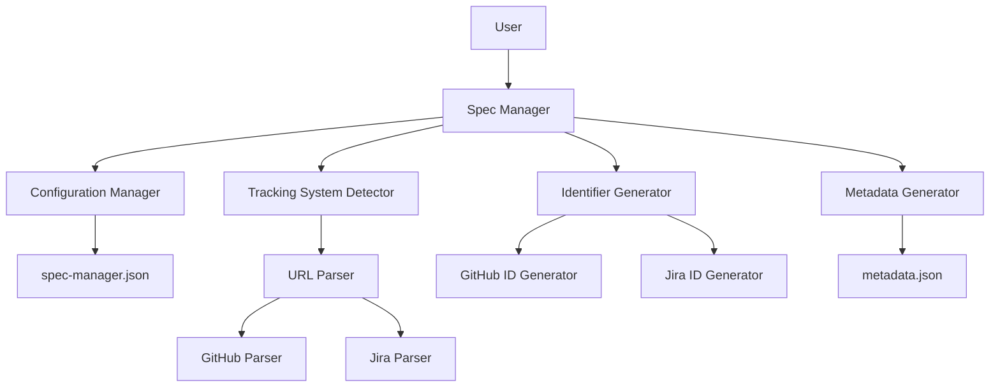
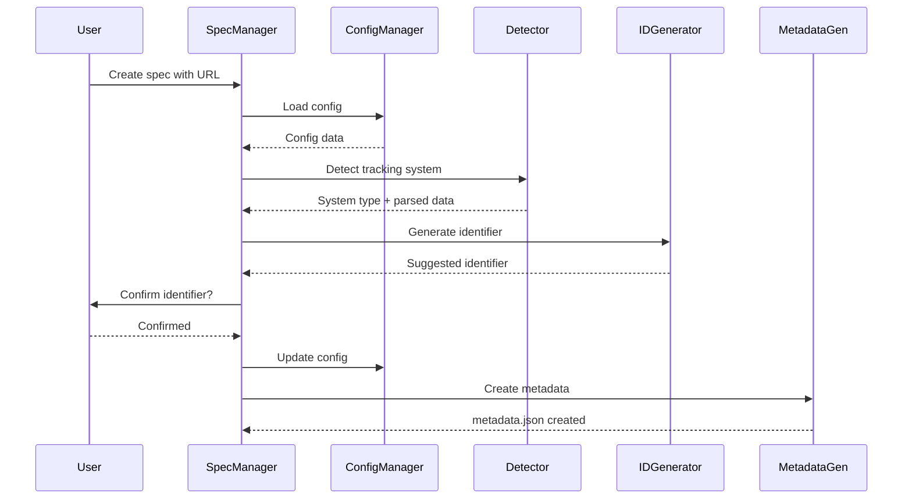

# Design Document: GitHub and Jira Compatibility

## Overview

Este diseño implementa soporte para sistemas de tracking externos (GitHub Issues y Jira) en el Spec Manager Power. El sistema detecta automáticamente el tipo de sistema de tracking basándose en patrones de URL, genera identificadores apropiados para cada sistema, y persiste la configuración del usuario en un archivo JSON para evitar retrabajo.

La arquitectura se basa en tres componentes principales:
1. **Configuration Manager**: Gestiona el archivo spec-manager.json
2. **Tracking System Detector**: Identifica el sistema de tracking y extrae información de URLs
3. **Identifier Generator**: Genera identificadores sintéticos apropiados para cada sistema

## Architecture

### Component Diagram



### Data Flow



## Components and Interfaces

### 1. Configuration Manager

**Responsibility**: Gestiona la lectura, escritura y validación del archivo spec-manager.json.

**Interface**:
```typescript
interface ConfigManager {
  loadConfig(): Config
  saveConfig(config: Config): void
  validateConfig(config: Config): boolean
  getDefaultConfig(): Config
  findKiroRoot(): string
}

interface Config {
  trackingSystem: "github" | "jira" | "none"
  githubRepository?: string
  jiraBaseUrl?: string
  jiraProject?: string
  lastUpdated: string
}
```

**Key Methods**:
- `loadConfig()`: Lee el archivo .kiro/spec-manager.json, crea uno por defecto si no existe
- `saveConfig()`: Escribe el archivo de configuración preservando campos personalizados
- `validateConfig()`: Valida la estructura del archivo contra el schema
- `findKiroRoot()`: Busca el directorio .kiro/ más cercano en la jerarquía de directorios

### 2. Tracking System Detector

**Responsibility**: Detecta el tipo de sistema de tracking basándose en URLs y extrae información relevante.

**Interface**:
```typescript
interface TrackingSystemDetector {
  detectSystem(url: string): TrackingSystemInfo
  parseGitHubUrl(url: string): GitHubInfo | null
  parseJiraUrl(url: string): JiraInfo | null
}

interface TrackingSystemInfo {
  type: "github" | "jira" | "unknown"
  data: GitHubInfo | JiraInfo | null
}

interface GitHubInfo {
  owner: string
  repo: string
  issueNumber: number
  repositoryUrl: string
  fullUrl: string
}

interface JiraInfo {
  domain: string
  issueKey: string
  project: string
  issueNumber: number
  baseUrl: string
  fullUrl: string
}
```

**Key Methods**:
- `detectSystem()`: Analiza una URL y determina el tipo de sistema
- `parseGitHubUrl()`: Extrae información de URLs de GitHub Issues
- `parseJiraUrl()`: Extrae información de URLs de Jira

**URL Patterns**:
- GitHub: `https://github.com/{owner}/{repo}/issues/{number}`
- GitHub Enterprise: `https://{custom-domain}/{owner}/{repo}/issues/{number}`
- Jira Cloud: `https://{domain}.atlassian.net/browse/{key}`
- Jira Server: `https://{domain}/browse/{key}` o `https://{domain}/projects/{project}/issues/{key}`

### 3. Identifier Generator

**Responsibility**: Genera identificadores sintéticos apropiados para cada sistema de tracking.

**Interface**:
```typescript
interface IdentifierGenerator {
  generateGitHubIdentifier(issueNumber: number): string
  generateJiraIdentifier(issueKey: string): string
  autoIncrementGitHub(specs: SpecMetadata[]): string
  autoIncrementJira(specs: SpecMetadata[], project: string): string
  extractNumberFromIdentifier(identifier: string): number | null
}
```

**Key Methods**:
- `generateGitHubIdentifier()`: Genera identificador con formato `GITHUB-{number}`
- `generateJiraIdentifier()`: Retorna la clave de Jira sin modificación
- `autoIncrementGitHub()`: Encuentra el último número de GitHub y sugiere el siguiente
- `autoIncrementJira()`: Encuentra el último número del proyecto Jira y sugiere el siguiente

**Identifier Formats**:
- GitHub: `GITHUB-1`, `GITHUB-42`, `GITHUB-123`
- Jira: `PROJECT-1`, `FEAT-42`, `BUG-123` (usa la clave directamente)

### 4. URL Reconstructor

**Responsibility**: Reconstruye URLs de issues basándose en la configuración almacenada.

**Interface**:
```typescript
interface URLReconstructor {
  reconstructGitHubUrl(issueNumber: number, config: Config): string | null
  reconstructJiraUrl(issueKey: string, config: Config): string | null
  canReconstruct(trackingSystem: string, config: Config): boolean
}
```

**Key Methods**:
- `reconstructGitHubUrl()`: Construye URL usando `{githubRepository}/issues/{number}`
- `reconstructJiraUrl()`: Construye URL usando `{jiraBaseUrl}/browse/{key}`
- `canReconstruct()`: Verifica si hay suficiente información en config para reconstruir

### 5. Metadata Generator

**Responsibility**: Crea y actualiza archivos metadata.json con información de tracking.

**Interface**:
```typescript
interface MetadataGenerator {
  createMetadata(spec: SpecInfo): SpecMetadata
  updateMetadata(path: string, updates: Partial<SpecMetadata>): void
  validateMetadata(metadata: SpecMetadata): boolean
}

interface SpecInfo {
  identifier: string
  name: string
  displayName: string
  url?: string
  assignee?: string
  tags?: string[]
  notes?: string
}

interface SpecMetadata {
  specIdentifier: string
  specName: string
  displayName: string
  created: string
  updated: string
  status: "draft" | "in-progress" | "completed" | "archived"
  url?: string
  assignee?: string
  tags?: string[]
  notes?: string
}
```

## Data Models

### spec-manager.json Schema

```json
{
  "$schema": "http://json-schema.org/draft-07/schema#",
  "type": "object",
  "required": ["trackingSystem", "lastUpdated"],
  "properties": {
    "trackingSystem": {
      "type": "string",
      "enum": ["github", "jira", "none"]
    },
    "githubRepository": {
      "type": "string",
      "pattern": "^https://[^/]+/[^/]+/[^/]+$",
      "description": "Base repository URL (e.g., https://github.com/owner/repo)"
    },
    "jiraBaseUrl": {
      "type": "string",
      "pattern": "^https://[^/]+$",
      "description": "Jira base URL (e.g., https://company.atlassian.net)"
    },
    "jiraProject": {
      "type": "string",
      "pattern": "^[A-Z][A-Z0-9]*$",
      "description": "Jira project key (e.g., PROJECT, FEAT)"
    },
    "lastUpdated": {
      "type": "string",
      "format": "date-time"
    }
  }
}
```

**Example - GitHub Configuration**:
```json
{
  "trackingSystem": "github",
  "githubRepository": "https://github.com/unlimitechcloud/kiro.spec-manager",
  "lastUpdated": "2026-01-16T10:30:00Z"
}
```

**Example - Jira Configuration**:
```json
{
  "trackingSystem": "jira",
  "jiraBaseUrl": "https://company.atlassian.net",
  "jiraProject": "PROJECT",
  "lastUpdated": "2026-01-16T10:30:00Z"
}
```

### metadata.json Extensions

No se requieren cambios en el schema de metadata.json. Los campos existentes son suficientes:
- `specIdentifier`: Almacena `GITHUB-{number}` o la clave de Jira
- `url`: Almacena la URL completa del issue

## Correctness Properties

*A property is a characteristic or behavior that should hold true across all valid executions of a system—essentially, a formal statement about what the system should do. Properties serve as the bridge between human-readable specifications and machine-verifiable correctness guarantees.*


### Property 1: Config File Creation and Initialization
*For any* system state where spec-manager.json does not exist, creating the config file should result in a valid file with default values that passes schema validation.
**Validates: Requirements 1.1, 1.2**

### Property 2: Config Persistence Round Trip
*For any* valid tracking system configuration (GitHub or Jira), storing it to the config file and then loading it should produce an equivalent configuration with all fields preserved.
**Validates: Requirements 1.3, 1.4, 1.5**

### Property 3: Config Validation and Recovery
*For any* invalid or corrupted config file, the system should handle it gracefully by creating a new valid config with default values without crashing.
**Validates: Requirements 1.6, 13.6**

### Property 4: Kiro Root Resolution
*For any* directory structure with multiple .kiro/ directories in parent paths, the system should consistently use the config file from the closest .kiro/ directory.
**Validates: Requirements 1.7**

### Property 5: URL Pattern Detection
*For any* URL string, the system should correctly identify whether it matches GitHub Issues, Jira, or neither, and extract the appropriate tracking system type.
**Validates: Requirements 2.1, 2.2, 2.3, 2.6**

### Property 6: GitHub URL Parsing Completeness
*For any* valid GitHub Issues URL (including GitHub Enterprise), parsing should extract all components: owner, repo, issue number, and repository URL, and these should be sufficient to reconstruct the original URL.
**Validates: Requirements 3.2, 3.3, 3.5**

### Property 7: Jira URL Parsing Completeness
*For any* valid Jira URL (Cloud or Server), parsing should extract all components: domain, issue key, project, and base URL, and these should be sufficient to reconstruct the original URL.
**Validates: Requirements 4.2, 4.3, 4.5**

### Property 8: Tracking System Config Persistence
*For any* detected tracking system (GitHub or Jira), the relevant configuration (repository URL or Jira base URL) should be automatically stored in the config file for future use.
**Validates: Requirements 2.4, 3.4, 4.4**

### Property 9: Config Fallback Behavior
*For any* spec creation request without a URL, if a tracking system is configured, the system should use the configured system's settings as defaults.
**Validates: Requirements 2.5**

### Property 10: GitHub Identifier Format
*For any* GitHub issue number, the generated identifier should follow the exact format `GITHUB-{number}` with no padding and the number preserved exactly as provided.
**Validates: Requirements 5.1, 5.2**

### Property 11: Jira Identifier Preservation
*For any* Jira issue key extracted from a URL, the identifier should be used directly without modification, preserving the exact format including project prefix and number.
**Validates: Requirements 6.1, 6.2**

### Property 12: Metadata Storage Consistency
*For any* confirmed identifier and URL pair, storing them in metadata.json should result in the identifier in the `specIdentifier` field and the URL in the `url` field, and this relationship should be preserved across updates.
**Validates: Requirements 5.4, 9.1, 9.2, 9.3, 9.5**

### Property 13: URL Reconstruction from Config
*For any* identifier (GitHub number or Jira key) and matching config (with repository URL or Jira base URL), the reconstructed URL should match the expected pattern for that tracking system.
**Validates: Requirements 7.1, 7.2, 7.3, 7.5**

### Property 14: GitHub Auto-increment
*For any* collection of specs with GitHub identifiers, finding the maximum issue number and incrementing by 1 should produce the next sequential identifier in the format `GITHUB-{max + 1}`.
**Validates: Requirements 10.1, 10.2, 10.3, 10.5**

### Property 15: Jira Auto-increment per Project
*For any* collection of specs with Jira identifiers for a specific project, finding the maximum issue number for that project and incrementing by 1 should produce the next sequential identifier in the format `{PROJECT}-{max + 1}`.
**Validates: Requirements 11.1, 11.2, 11.3, 11.5**

### Property 16: Identifier Search
*For any* spec collection and identifier query (GitHub or Jira format), searching should find the spec with matching identifier, and the result should include both the identifier and the URL.
**Validates: Requirements 8.5, 12.1, 12.3, 12.4**

### Property 17: GitHub Fuzzy Number Search
*For any* numeric query and spec collection containing GitHub specs, searching with just the number should match specs with identifier `GITHUB-{number}`.
**Validates: Requirements 12.2**

### Property 18: Config Schema Validation
*For any* config file, validation should verify the presence of required fields (`trackingSystem`, `lastUpdated`) and conditional fields based on the tracking system type.
**Validates: Requirements 13.1, 13.2, 13.3, 13.4, 13.5**

### Property 19: Custom Fields Preservation
*For any* config file containing additional custom fields beyond the schema, updating the config should preserve all custom fields while updating only the specified fields.
**Validates: Requirements 13.7**

### Property 20: URL and Identifier Validation
*For any* metadata being stored, the URL should match the expected pattern for the tracking system indicated by the identifier format.
**Validates: Requirements 9.4**

## Error Handling

### Configuration Errors

**Invalid Config File**:
- Detect: JSON parse errors, missing required fields, invalid field values
- Handle: Log warning, create new config with defaults, continue operation
- User feedback: "Config file was invalid and has been reset to defaults"

**Missing Config File**:
- Detect: File not found at .kiro/spec-manager.json
- Handle: Create new config with defaults silently
- User feedback: None (transparent operation)

**Multiple Kiro Roots**:
- Detect: Multiple .kiro/ directories in parent paths
- Handle: Use closest one, log which one was selected
- User feedback: "Using config from {path}"

### URL Parsing Errors

**Invalid GitHub URL**:
- Detect: URL matches github.com but doesn't match issues pattern
- Handle: Treat as generic external URL
- User feedback: "URL doesn't match GitHub Issues pattern, treating as generic URL"

**Invalid Jira URL**:
- Detect: URL matches Jira domain but doesn't match expected patterns
- Handle: Treat as generic external URL
- User feedback: "URL doesn't match Jira pattern, treating as generic URL"

**Malformed URL**:
- Detect: URL parsing fails
- Handle: Reject URL, ask user to provide valid URL
- User feedback: "Invalid URL format, please provide a valid URL"

### Identifier Generation Errors

**No Previous Specs for Auto-increment**:
- Detect: Empty spec collection when auto-increment requested
- Handle: Suggest starting identifier (GITHUB-1 or PROJECT-1)
- User feedback: "No previous specs found, suggesting {identifier}"

**Conflicting Identifier**:
- Detect: Generated identifier already exists
- Handle: Warn user, allow override or suggest alternative
- User feedback: "Identifier {id} already exists, please choose another"

### Metadata Errors

**URL/Identifier Mismatch**:
- Detect: GitHub identifier with Jira URL or vice versa
- Handle: Warn user, ask for confirmation
- User feedback: "Warning: Identifier format doesn't match URL system"

**Missing Required Fields**:
- Detect: Metadata missing required fields
- Handle: Reject metadata creation, ask for missing fields
- User feedback: "Missing required field: {field}"

## Testing Strategy

### Unit Tests

Unit tests will verify specific examples and edge cases:

**Configuration Management**:
- Test creating config file when it doesn't exist
- Test loading valid config file
- Test handling corrupted config file
- Test finding closest .kiro/ directory
- Test preserving custom fields during updates

**URL Parsing**:
- Test parsing standard GitHub URLs
- Test parsing GitHub Enterprise URLs
- Test parsing Jira Cloud URLs
- Test parsing Jira Server URLs
- Test handling invalid URLs
- Test extracting all components correctly

**Identifier Generation**:
- Test GitHub identifier format
- Test Jira identifier preservation
- Test auto-increment with empty collection (edge case)
- Test auto-increment with existing specs
- Test handling identifier conflicts

**Metadata Operations**:
- Test storing metadata with GitHub identifiers
- Test storing metadata with Jira identifiers
- Test URL/identifier validation
- Test preserving relationships across updates

### Property-Based Tests

Property-based tests will verify universal properties across many generated inputs. Each test will run a minimum of 100 iterations.

**Config Round Trip** (Property 2):
- Generate random valid configs
- Store and load each config
- Verify loaded config equals original
- Tag: **Feature: github-compatibility, Property 2: Config Persistence Round Trip**

**URL Pattern Detection** (Property 5):
- Generate random URLs (GitHub, Jira, generic)
- Verify correct system detection for each
- Tag: **Feature: github-compatibility, Property 5: URL Pattern Detection**

**GitHub URL Parsing** (Property 6):
- Generate random valid GitHub URLs
- Parse each URL
- Reconstruct URL from parsed components
- Verify reconstructed URL matches original
- Tag: **Feature: github-compatibility, Property 6: GitHub URL Parsing Completeness**

**Jira URL Parsing** (Property 7):
- Generate random valid Jira URLs
- Parse each URL
- Reconstruct URL from parsed components
- Verify reconstructed URL matches original
- Tag: **Feature: github-compatibility, Property 7: Jira URL Parsing Completeness**

**GitHub Identifier Format** (Property 10):
- Generate random issue numbers
- Create identifier for each
- Verify format matches `GITHUB-{number}`
- Verify number is preserved exactly
- Tag: **Feature: github-compatibility, Property 10: GitHub Identifier Format**

**Jira Identifier Preservation** (Property 11):
- Generate random Jira keys
- Process each key
- Verify key is unchanged
- Tag: **Feature: github-compatibility, Property 11: Jira Identifier Preservation**

**URL Reconstruction** (Property 13):
- Generate random configs and identifiers
- Reconstruct URLs
- Verify URLs match expected patterns
- Tag: **Feature: github-compatibility, Property 13: URL Reconstruction from Config**

**GitHub Auto-increment** (Property 14):
- Generate random collections of GitHub specs
- Find max and increment
- Verify result is max + 1
- Tag: **Feature: github-compatibility, Property 14: GitHub Auto-increment**

**Jira Auto-increment** (Property 15):
- Generate random collections of Jira specs
- Find max for project and increment
- Verify result is max + 1 for that project
- Tag: **Feature: github-compatibility, Property 15: Jira Auto-increment per Project**

**Custom Fields Preservation** (Property 19):
- Generate configs with random custom fields
- Update configs
- Verify custom fields are preserved
- Tag: **Feature: github-compatibility, Property 19: Custom Fields Preservation**

**Config Validation** (Property 18):
- Generate random config structures (valid and invalid)
- Validate each
- Verify correct validation results
- Tag: **Feature: github-compatibility, Property 18: Config Schema Validation**

### Integration Tests

Integration tests will verify end-to-end workflows:

- Create spec with GitHub URL → verify config updated, metadata correct
- Create spec with Jira URL → verify config updated, metadata correct
- Auto-increment GitHub → verify next identifier suggested correctly
- Auto-increment Jira → verify next identifier suggested correctly
- Search by identifier → verify correct spec found
- URL reconstruction → verify correct URL generated from config

### Testing Framework

The implementation will use:
- **Unit Testing**: Jest (for TypeScript/JavaScript implementation)
- **Property-Based Testing**: fast-check library
- **Minimum Iterations**: 100 per property test
- **Coverage Target**: 90% code coverage for core logic

### Test Data Generators

Property tests will use smart generators:

**GitHub URL Generator**:
```typescript
fc.record({
  owner: fc.stringOf(fc.constantFrom(...alphanumeric), {minLength: 1, maxLength: 39}),
  repo: fc.stringOf(fc.constantFrom(...alphanumeric, '-', '_'), {minLength: 1}),
  issueNumber: fc.integer({min: 1, max: 999999})
}).map(({owner, repo, issueNumber}) => 
  `https://github.com/${owner}/${repo}/issues/${issueNumber}`
)
```

**Jira URL Generator**:
```typescript
fc.record({
  domain: fc.domain(),
  project: fc.stringOf(fc.constantFrom(...uppercase), {minLength: 2, maxLength: 10}),
  issueNumber: fc.integer({min: 1, max: 999999})
}).map(({domain, project, issueNumber}) => 
  `https://${domain}/browse/${project}-${issueNumber}`
)
```

**Config Generator**:
```typescript
fc.oneof(
  fc.record({
    trackingSystem: fc.constant('github'),
    githubRepository: githubRepoUrlGen,
    lastUpdated: fc.date().map(d => d.toISOString())
  }),
  fc.record({
    trackingSystem: fc.constant('jira'),
    jiraBaseUrl: fc.webUrl(),
    jiraProject: fc.stringOf(fc.constantFrom(...uppercase), {minLength: 2, maxLength: 10}),
    lastUpdated: fc.date().map(d => d.toISOString())
  })
)
```
