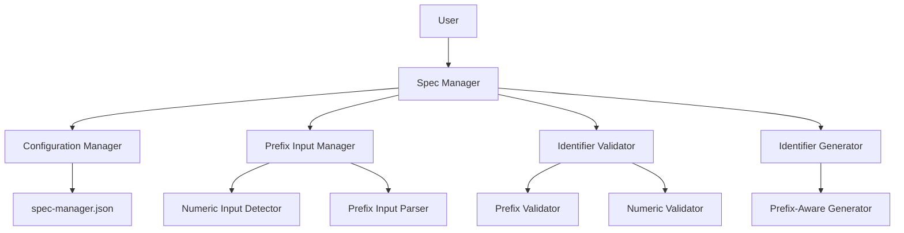
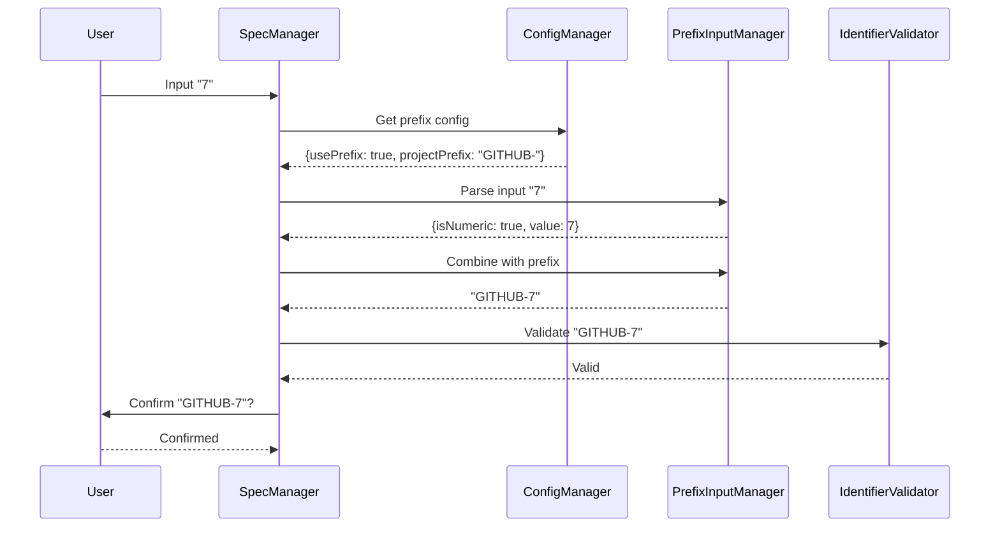
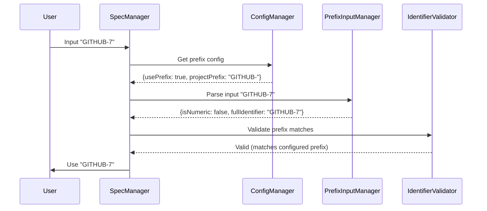

# Design Document: Prefix-Aware Input

## Overview

Este diseño implementa un sistema de entrada inteligente que permite a los usuarios trabajar con identificadores que tienen prefijos de proyecto (como "GITHUB-", "PROJECT-", etc.) de manera más eficiente. En lugar de requerir que el usuario escriba el identificador completo cada vez, el sistema detecta automáticamente cuando se proporciona solo la parte numérica y la combina con el prefijo configurado.

La arquitectura extiende el sistema existente de Configuration Manager y se integra perfectamente con los flujos de GitHub y Jira, proporcionando una experiencia de usuario más fluida sin sacrificar flexibilidad.

## Architecture

### Component Diagram



### Data Flow for Numeric Input



### Data Flow for Full Identifier Input



## Components and Interfaces

### 1. Prefix Input Manager

**Responsibility**: Detecta el tipo de entrada del usuario (numérica o completa) y la procesa según el modo de prefijos configurado.

**Interface**:
```typescript
interface PrefixInputManager {
  parseInput(input: string, config: PrefixConfig): ParsedInput
  isNumericInput(input: string): boolean
  combineWithPrefix(numericValue: number, prefix: string): string
  extractNumericPortion(identifier: string, prefix: string): number | null
  suggestIdentifier(lastNumber: number, prefix: string): IdentifierSuggestion
}

interface PrefixConfig {
  usePrefix: boolean
  projectPrefix?: string
}

interface ParsedInput {
  isNumeric: boolean
  numericValue?: number
  fullIdentifier?: string
  needsPrefix: boolean
}

interface IdentifierSuggestion {
  fullIdentifier: string
  numericPortion: number
  exampleNumericInput: string
  promptMessage: string
}
```

**Key Methods**:
- `parseInput()`: Analiza la entrada del usuario y determina si es numérica o completa
- `isNumericInput()`: Verifica si la entrada contiene solo dígitos
- `combineWithPrefix()`: Combina un valor numérico con el prefijo configurado
- `extractNumericPortion()`: Extrae la parte numérica de un identificador completo
- `suggestIdentifier()`: Genera una sugerencia de identificador con ejemplos de uso

**Input Detection Logic**:
```typescript
function parseInput(input: string, config: PrefixConfig): ParsedInput {
  const trimmed = input.trim()
  
  // Si el modo de prefijos está deshabilitado, usar como está
  if (!config.usePrefix) {
    return {
      isNumeric: false,
      fullIdentifier: trimmed,
      needsPrefix: false
    }
  }
  
  // Detectar si es puramente numérico
  if (/^\d+$/.test(trimmed)) {
    const numericValue = parseInt(trimmed, 10)
    return {
      isNumeric: true,
      numericValue,
      needsPrefix: true
    }
  }
  
  // Es un identificador completo
  return {
    isNumeric: false,
    fullIdentifier: trimmed,
    needsPrefix: false
  }
}
```

### 2. Identifier Validator

**Responsibility**: Valida que los identificadores sean consistentes con la configuración de prefijos y que los valores numéricos sean válidos.

**Interface**:
```typescript
interface IdentifierValidator {
  validateNumericInput(value: number): ValidationResult
  validatePrefixMatch(identifier: string, expectedPrefix: string): ValidationResult
  validatePrefixFormat(prefix: string): ValidationResult
  checkForConflicts(identifier: string, existingSpecs: SpecMetadata[]): ConflictResult
}

interface ValidationResult {
  isValid: boolean
  errorMessage?: string
  warningMessage?: string
}

interface ConflictResult {
  hasConflict: boolean
  conflictingSpec?: SpecMetadata
  suggestion?: string
}
```

**Key Methods**:
- `validateNumericInput()`: Valida que el número sea positivo, entero, sin ceros a la izquierda
- `validatePrefixMatch()`: Verifica que un identificador completo use el prefijo esperado
- `validatePrefixFormat()`: Valida el formato del prefijo (alfanumérico + separador)
- `checkForConflicts()`: Detecta si el identificador ya existe

**Validation Rules**:
```typescript
function validateNumericInput(value: number): ValidationResult {
  // Debe ser entero positivo
  if (!Number.isInteger(value) || value <= 0) {
    return {
      isValid: false,
      errorMessage: "Identifier number must be a positive integer"
    }
  }
  
  return { isValid: true }
}

function validatePrefixMatch(identifier: string, expectedPrefix: string): ValidationResult {
  if (!identifier.startsWith(expectedPrefix)) {
    return {
      isValid: false,
      warningMessage: `Identifier doesn't match expected prefix "${expectedPrefix}". Provided: "${identifier}"`
    }
  }
  
  return { isValid: true }
}

function validatePrefixFormat(prefix: string): ValidationResult {
  // Debe terminar con - o _
  if (!/[-_]$/.test(prefix)) {
    return {
      isValid: false,
      errorMessage: "Prefix must end with a separator (- or _)"
    }
  }
  
  // Solo alfanuméricos y separadores
  if (!/^[A-Za-z0-9_-]+$/.test(prefix)) {
    return {
      isValid: false,
      errorMessage: "Prefix must contain only alphanumeric characters and separators"
    }
  }
  
  return { isValid: true }
}
```

### 3. Configuration Manager Extensions

**Responsibility**: Extiende el Configuration Manager existente para soportar campos de configuración de prefijos.

**Extended Interface**:
```typescript
interface Config {
  trackingSystem: "github" | "jira" | "none"
  githubRepository?: string
  jiraBaseUrl?: string
  jiraProject?: string
  lastUpdated: string
  
  // Nuevos campos para prefix-aware input
  usePrefix?: boolean
  projectPrefix?: string
}

interface ConfigManager {
  // Métodos existentes
  loadConfig(): Config
  saveConfig(config: Config): void
  validateConfig(config: Config): boolean
  
  // Nuevos métodos
  enablePrefixMode(prefix: string): void
  disablePrefixMode(): void
  getPrefixConfig(): PrefixConfig
  detectPrefixFromSpecs(specs: SpecMetadata[]): string | null
}
```

**Key Methods**:
- `enablePrefixMode()`: Activa el modo de prefijos con el prefijo especificado
- `disablePrefixMode()`: Desactiva el modo de prefijos (preserva el prefijo configurado)
- `getPrefixConfig()`: Retorna la configuración actual de prefijos
- `detectPrefixFromSpecs()`: Analiza specs existentes para detectar un prefijo común

**Prefix Detection Logic**:
```typescript
function detectPrefixFromSpecs(specs: SpecMetadata[]): string | null {
  const prefixCounts = new Map<string, number>()
  
  for (const spec of specs) {
    const match = spec.specIdentifier.match(/^([A-Z][A-Z0-9]*[-_])/)
    if (match) {
      const prefix = match[1]
      prefixCounts.set(prefix, (prefixCounts.get(prefix) || 0) + 1)
    }
  }
  
  // Encontrar el prefijo más común
  let mostCommonPrefix: string | null = null
  let maxCount = 0
  
  for (const [prefix, count] of prefixCounts) {
    // Requiere al menos 2 specs con el mismo prefijo
    if (count >= 2 && count > maxCount) {
      mostCommonPrefix = prefix
      maxCount = count
    }
  }
  
  return mostCommonPrefix
}
```

### 4. Prefix-Aware Identifier Generator

**Responsibility**: Extiende el Identifier Generator existente para trabajar con el modo de prefijos.

**Extended Interface**:
```typescript
interface IdentifierGenerator {
  // Métodos existentes
  generateGitHubIdentifier(issueNumber: number): string
  generateJiraIdentifier(issueKey: string): string
  autoIncrementGitHub(specs: SpecMetadata[]): string
  autoIncrementJira(specs: SpecMetadata[], project: string): string
  
  // Nuevos métodos
  autoIncrementWithPrefix(specs: SpecMetadata[], prefix: string): AutoIncrementResult
  suggestNextIdentifier(specs: SpecMetadata[], config: PrefixConfig): IdentifierSuggestion
}

interface AutoIncrementResult {
  suggestedIdentifier: string
  numericPortion: number
  canUseNumericInput: boolean
  exampleInputs: string[]
}
```

**Key Methods**:
- `autoIncrementWithPrefix()`: Encuentra el último número para un prefijo y sugiere el siguiente
- `suggestNextIdentifier()`: Genera una sugerencia inteligente basada en la configuración

### 5. User Interaction Handler

**Responsibility**: Maneja la interacción con el usuario para entrada de identificadores con soporte de prefijos.

**Interface**:
```typescript
interface UserInteractionHandler {
  promptForIdentifier(config: PrefixConfig, suggestion?: IdentifierSuggestion): Promise<string>
  confirmIdentifier(identifier: string): Promise<boolean>
  handlePrefixMismatch(provided: string, expected: string): Promise<PrefixMismatchAction>
  handleConflict(identifier: string, conflict: ConflictResult): Promise<ConflictAction>
}

type PrefixMismatchAction = "use-as-is" | "correct" | "cancel"
type ConflictAction = "override" | "choose-different" | "cancel"
```

**Key Methods**:
- `promptForIdentifier()`: Muestra un prompt inteligente basado en la configuración de prefijos
- `confirmIdentifier()`: Pide confirmación del identificador final
- `handlePrefixMismatch()`: Maneja casos donde el prefijo no coincide
- `handleConflict()`: Maneja conflictos de identificadores duplicados

**Prompt Examples**:
```typescript
// Con prefix mode habilitado
"Identifier (GITHUB-): [Press Enter for GITHUB-6, or type '7' for GITHUB-7]"

// Con prefix mode deshabilitado
"Identifier: [Press Enter for auto-increment]"

// Confirmación
"Use identifier 'GITHUB-7'? (y/n)"

// Mismatch warning
"⚠️  Warning: Identifier 'PROJECT-5' doesn't match expected prefix 'GITHUB-'
  Expected: GITHUB-5
  Provided: PROJECT-5
  
  What would you like to do?
  1. Use 'PROJECT-5' as-is
  2. Correct to 'GITHUB-5'
  3. Cancel and re-enter"
```

## Data Models

### Extended spec-manager.json Schema

```json
{
  "$schema": "http://json-schema.org/draft-07/schema#",
  "type": "object",
  "required": ["trackingSystem", "lastUpdated"],
  "properties": {
    "trackingSystem": {
      "type": "string",
      "enum": ["github", "jira", "none"]
    },
    "githubRepository": {
      "type": "string",
      "pattern": "^https://[^/]+/[^/]+/[^/]+$"
    },
    "jiraBaseUrl": {
      "type": "string",
      "pattern": "^https://[^/]+$"
    },
    "jiraProject": {
      "type": "string",
      "pattern": "^[A-Z][A-Z0-9]*$"
    },
    "usePrefix": {
      "type": "boolean",
      "default": false,
      "description": "Whether to enable prefix-aware input mode"
    },
    "projectPrefix": {
      "type": "string",
      "pattern": "^[A-Za-z0-9]+[-_]$",
      "description": "The prefix to use for identifiers (e.g., 'GITHUB-', 'PROJECT-')"
    },
    "lastUpdated": {
      "type": "string",
      "format": "date-time"
    }
  },
  "if": {
    "properties": { "usePrefix": { "const": true } }
  },
  "then": {
    "required": ["projectPrefix"]
  }
}
```

**Example - GitHub with Prefix Mode**:
```json
{
  "trackingSystem": "github",
  "githubRepository": "https://github.com/owner/repo",
  "usePrefix": true,
  "projectPrefix": "GITHUB-",
  "lastUpdated": "2026-01-16T10:30:00Z"
}
```

**Example - Jira with Prefix Mode**:
```json
{
  "trackingSystem": "jira",
  "jiraBaseUrl": "https://company.atlassian.net",
  "jiraProject": "PROJECT",
  "usePrefix": true,
  "projectPrefix": "PROJECT-",
  "lastUpdated": "2026-01-16T10:30:00Z"
}
```

**Example - Custom Prefix**:
```json
{
  "trackingSystem": "none",
  "usePrefix": true,
  "projectPrefix": "FEAT-",
  "lastUpdated": "2026-01-16T10:30:00Z"
}
```

## Correctness Properties

*A property is a characteristic or behavior that should hold true across all valid executions of a system—essentially, a formal statement about what the system should do. Properties serve as the bridge between human-readable specifications and machine-verifiable correctness guarantees.*


### Property 1: Config Structure Completeness
*For any* newly created config file with prefix mode enabled, it should contain both `usePrefix` and `projectPrefix` fields with valid values.
**Validates: Requirements 1.1, 1.2**

### Property 2: Tracking System Prefix Activation
*For any* detected tracking system URL (GitHub or Jira), processing it should result in `usePrefix` being set to true in the config.
**Validates: Requirements 1.3**

### Property 3: GitHub Prefix Assignment
*For any* GitHub URL detection, the resulting config should have `projectPrefix` set to exactly "GITHUB-".
**Validates: Requirements 1.4**

### Property 4: Jira Prefix Extraction
*For any* Jira URL with a project key, the resulting config should have `projectPrefix` set to "{PROJECT_KEY}-" where PROJECT_KEY matches the extracted project.
**Validates: Requirements 1.5**

### Property 5: Prefix Mode Toggle Preservation
*For any* config with a `projectPrefix` value, disabling prefix mode should set `usePrefix` to false while preserving the `projectPrefix` value unchanged.
**Validates: Requirements 1.7, 8.4**

### Property 6: Numeric Input Detection
*For any* input string when prefix mode is enabled, if the string contains only digits, it should be detected as numeric input.
**Validates: Requirements 2.1**

### Property 7: Numeric Input Interpretation
*For any* purely numeric input when prefix mode is enabled, it should be treated as the numeric portion and combined with the configured prefix.
**Validates: Requirements 2.2, 2.4**

### Property 8: Full Identifier Passthrough
*For any* input that contains the configured prefix when prefix mode is enabled, it should be accepted as a full identifier without modification.
**Validates: Requirements 2.3**

### Property 9: Prefix Mode Disabled Passthrough
*For any* input when prefix mode is disabled, the output identifier should be identical to the input without any transformation.
**Validates: Requirements 2.5**

### Property 10: Suggestion Format
*For any* identifier suggestion when prefix mode is enabled, the suggested identifier should be a full identifier including the configured prefix.
**Validates: Requirements 3.1, 3.2**

### Property 11: Prefix Validation
*For any* full identifier input when prefix mode is enabled, validation should verify that it starts with the configured prefix.
**Validates: Requirements 3.4, 4.1**

### Property 12: Prefix Mismatch Warning
*For any* full identifier that doesn't start with the configured prefix, the system should generate a warning containing both the expected prefix and the provided identifier.
**Validates: Requirements 3.5, 4.2, 4.3**

### Property 13: User Choice Respect
*For any* identifier that fails prefix validation, if the user chooses to proceed, the system should use the identifier exactly as provided.
**Validates: Requirements 4.5**

### Property 14: Prompt Content Completeness
*For any* identifier prompt when prefix mode is enabled, the prompt should contain the configured prefix and indicate that numeric input is accepted.
**Validates: Requirements 5.1, 5.2, 5.3**

### Property 15: Auto-increment Maximum Finding
*For any* collection of specs with identifiers matching the configured prefix, auto-increment should find the highest numeric portion correctly.
**Validates: Requirements 6.1**

### Property 16: Auto-increment Sequential Suggestion
*For any* collection of specs with a maximum numeric portion N, the auto-increment suggestion should be N+1 with the configured prefix.
**Validates: Requirements 6.2**

### Property 17: Backwards Number Warning
*For any* numeric input that is less than the current maximum numeric portion for the prefix, the system should generate a warning about potential conflicts.
**Validates: Requirements 6.4**

### Property 18: Numeric Value Acceptance
*For any* positive integer provided as numeric input, the system should accept it and combine it with the configured prefix.
**Validates: Requirements 6.5**

### Property 19: Prefix Pattern Detection
*For any* collection of specs where at least 2 specs share the same prefix pattern (format: "{PREFIX}-{NUMBER}"), the system should detect that common prefix.
**Validates: Requirements 7.1, 7.2**

### Property 20: Prefix Detection Suggestion
*For any* detected common prefix from existing specs, the system should suggest enabling prefix mode with that prefix.
**Validates: Requirements 7.3**

### Property 21: Config Update After Detection
*For any* detected prefix that the user confirms, the config should be updated with `usePrefix: true` and `projectPrefix` set to the detected value.
**Validates: Requirements 7.5**

### Property 22: No Auto-enable Without Pattern
*For any* collection of specs where no consistent prefix pattern exists (fewer than 2 specs with the same prefix), prefix mode should remain disabled.
**Validates: Requirements 7.6**

### Property 23: Backwards Compatibility Recognition
*For any* collection of specs with mixed identifier formats (with and without the configured prefix), all specs should be recognized and queryable.
**Validates: Requirements 9.1, 9.3, 9.4**

### Property 24: Metadata Preservation
*For any* existing metadata.json files, enabling prefix mode should not modify any of them.
**Validates: Requirements 9.2**

### Property 25: Display Fidelity
*For any* spec identifier stored in metadata, displaying it should show the exact value without transformation.
**Validates: Requirements 9.5**

### Property 26: Conditional Field Requirement
*For any* config where `usePrefix` is true, validation should fail if `projectPrefix` is missing or empty.
**Validates: Requirements 10.3**

### Property 27: Prefix Format Validation - Separator
*For any* `projectPrefix` value, validation should verify it ends with either a hyphen (-) or underscore (_).
**Validates: Requirements 10.4**

### Property 28: Prefix Format Validation - Characters
*For any* `projectPrefix` value, validation should verify it contains only alphanumeric characters and separators (- or _).
**Validates: Requirements 10.5**

### Property 29: Validation Error Handling
*For any* invalid config, the system should display an error and fall back to default behavior without crashing.
**Validates: Requirements 10.6**

### Property 30: Tracking System Change Updates
*For any* config with an existing tracking system, changing to a different tracking system should update the `projectPrefix` to match the new system.
**Validates: Requirements 11.5**

### Property 31: Numeric Input Validation - Positive Integer
*For any* numeric input, validation should verify it is a positive integer (greater than 0, no decimals).
**Validates: Requirements 12.1**

### Property 32: Numeric Input Validation - Rejection
*For any* input that is negative, zero, or non-integer, validation should reject it.
**Validates: Requirements 12.2**

### Property 33: Leading Zeros Rejection
*For any* numeric input string that starts with "0" (like "007", "01"), validation should reject it.
**Validates: Requirements 12.3**

### Property 34: Invalid Input Error Display
*For any* invalid numeric input, the system should display an error message explaining why it was rejected.
**Validates: Requirements 12.4**

### Property 35: URL Reconstruction with Numeric Input
*For any* numeric input when URL reconstruction is enabled, the reconstructed URL should use the numeric value in the appropriate position for the tracking system.
**Validates: Requirements 13.1, 13.2, 13.3**

### Property 36: Storage Consistency
*For any* confirmed identifier and reconstructed URL, both the full identifier and the URL should be stored in metadata correctly.
**Validates: Requirements 13.5**

## Error Handling

### Configuration Errors

**Invalid Prefix Format**:
- Detect: Prefix doesn't end with separator, or contains invalid characters
- Handle: Display error, prompt user to provide valid prefix
- User feedback: "Invalid prefix format. Prefix must end with '-' or '_' and contain only alphanumeric characters."

**Missing Prefix When Required**:
- Detect: `usePrefix` is true but `projectPrefix` is missing
- Handle: Prompt user to provide prefix or disable prefix mode
- User feedback: "Prefix mode is enabled but no prefix is configured. Please provide a prefix or disable prefix mode."

**Prefix Mode Conflict**:
- Detect: User tries to enable prefix mode with existing non-prefixed identifiers
- Handle: Warn user, explain implications, ask for confirmation
- User feedback: "Warning: Existing specs don't use prefixes. Enabling prefix mode will only affect new specs."

### Input Validation Errors

**Invalid Numeric Input**:
- Detect: Negative number, zero, decimal, or leading zeros
- Handle: Display specific error, prompt for valid input
- User feedback: 
  - "Identifier number must be positive (greater than 0)"
  - "Identifier number must be an integer (no decimals)"
  - "Identifier number cannot have leading zeros"

**Prefix Mismatch**:
- Detect: Full identifier doesn't start with configured prefix
- Handle: Display warning with expected vs provided, offer options
- User feedback:
```
⚠️  Warning: Identifier doesn't match expected prefix
  Expected prefix: GITHUB-
  Provided: PROJECT-5
  
  Options:
  1. Use 'PROJECT-5' as-is
  2. Correct to 'GITHUB-5'
  3. Re-enter identifier
```

**Identifier Conflict**:
- Detect: Provided identifier already exists
- Handle: Display conflict, show existing spec, offer alternatives
- User feedback:
```
❌ Identifier 'GITHUB-5' already exists
  Existing spec: "User Authentication Feature"
  
  Suggestions:
  - Use 'GITHUB-6' (next available)
  - Choose a different number
  - Override existing spec (not recommended)
```

**Backwards Number Warning**:
- Detect: Numeric input is less than current maximum
- Handle: Display warning, explain potential issues, allow proceeding
- User feedback:
```
⚠️  Warning: Number 3 is less than current maximum (5)
  This may cause confusion with spec ordering.
  
  Proceed with GITHUB-3? (y/n)
```

### Prefix Detection Errors

**No Consistent Prefix Found**:
- Detect: Fewer than 2 specs share the same prefix
- Handle: Don't auto-enable, inform user they can manually configure
- User feedback: "No consistent prefix pattern detected. You can manually configure a prefix if desired."

**Multiple Prefix Patterns**:
- Detect: Multiple prefixes with similar usage counts
- Handle: Show all detected patterns, ask user to choose
- User feedback:
```
Multiple prefix patterns detected:
  1. GITHUB- (3 specs)
  2. FEAT- (2 specs)
  
  Which prefix would you like to use?
```

### URL Reconstruction Errors

**Missing Repository Configuration**:
- Detect: Numeric input provided but no repository URL in config
- Handle: Prompt for full URL or ask to configure repository
- User feedback: "Cannot reconstruct URL. Please provide the full URL or configure the repository in settings."

**Invalid Reconstructed URL**:
- Detect: Reconstructed URL doesn't match expected pattern
- Handle: Display reconstructed URL, ask for confirmation or manual entry
- User feedback: "Reconstructed URL: {url}. Does this look correct? (y/n)"

## Testing Strategy

### Unit Tests

Unit tests will verify specific examples and edge cases:

**Prefix Input Manager**:
- Test numeric input detection with various formats
- Test combining numeric values with prefixes
- Test extracting numeric portions from full identifiers
- Test handling edge cases (empty input, whitespace, special characters)

**Identifier Validator**:
- Test positive integer validation
- Test rejection of invalid numbers (negative, zero, decimals, leading zeros)
- Test prefix format validation (separator, characters)
- Test prefix matching validation
- Test conflict detection

**Configuration Manager**:
- Test enabling/disabling prefix mode
- Test prefix detection from existing specs
- Test config updates when tracking system changes
- Test preserving custom fields during updates

**URL Reconstruction**:
- Test GitHub URL reconstruction with numeric input
- Test Jira URL reconstruction with numeric input
- Test handling missing configuration

### Property-Based Tests

Property-based tests will verify universal properties across many generated inputs. Each test will run a minimum of 100 iterations.

**Numeric Input Detection** (Property 6):
- Generate random strings (numeric and non-numeric)
- Verify numeric strings are detected correctly
- Tag: **Feature: prefix-aware-input, Property 6: Numeric Input Detection**

**Numeric Input Combination** (Property 7):
- Generate random numeric values and prefixes
- Combine them and verify format
- Tag: **Feature: prefix-aware-input, Property 7: Numeric Input Interpretation**

**Prefix Mode Disabled Passthrough** (Property 9):
- Generate random input strings
- Process with prefix mode disabled
- Verify output equals input
- Tag: **Feature: prefix-aware-input, Property 9: Prefix Mode Disabled Passthrough**

**Prefix Validation** (Property 11):
- Generate random identifiers with various prefixes
- Validate against configured prefix
- Verify correct validation results
- Tag: **Feature: prefix-aware-input, Property 11: Prefix Validation**

**Auto-increment Maximum Finding** (Property 15):
- Generate random collections of specs with prefixed identifiers
- Find maximum numeric portion
- Verify it matches the actual maximum
- Tag: **Feature: prefix-aware-input, Property 15: Auto-increment Maximum Finding**

**Auto-increment Sequential** (Property 16):
- Generate random collections of specs
- Calculate next identifier
- Verify it's max + 1 with prefix
- Tag: **Feature: prefix-aware-input, Property 16: Auto-increment Sequential Suggestion**

**Prefix Pattern Detection** (Property 19):
- Generate random collections of specs with various identifier patterns
- Detect common prefixes
- Verify detection when 2+ specs share a prefix
- Tag: **Feature: prefix-aware-input, Property 19: Prefix Pattern Detection**

**Backwards Compatibility** (Property 23):
- Generate collections with mixed identifier formats
- Query for specs
- Verify all specs are found regardless of format
- Tag: **Feature: prefix-aware-input, Property 23: Backwards Compatibility Recognition**

**Metadata Preservation** (Property 24):
- Generate random metadata files
- Enable prefix mode
- Verify no metadata files were modified
- Tag: **Feature: prefix-aware-input, Property 24: Metadata Preservation**

**Prefix Format Validation** (Properties 27, 28):
- Generate random prefix strings (valid and invalid)
- Validate each
- Verify correct validation results
- Tag: **Feature: prefix-aware-input, Property 27-28: Prefix Format Validation**

**Numeric Input Validation** (Properties 31, 32, 33):
- Generate random numeric inputs (valid and invalid)
- Validate each
- Verify correct validation results
- Tag: **Feature: prefix-aware-input, Property 31-33: Numeric Input Validation**

**URL Reconstruction** (Property 35):
- Generate random numeric inputs and configs
- Reconstruct URLs
- Verify URLs match expected patterns
- Tag: **Feature: prefix-aware-input, Property 35: URL Reconstruction with Numeric Input**

### Integration Tests

Integration tests will verify end-to-end workflows:

- Create spec with GitHub URL → verify prefix mode enabled with "GITHUB-"
- Create spec with numeric input → verify full identifier created correctly
- Create spec with full identifier → verify prefix validation works
- Auto-increment with prefix mode → verify next identifier suggested correctly
- Enable prefix mode manually → verify config updated correctly
- Detect prefix from existing specs → verify detection and suggestion work
- Query specs with mixed formats → verify all specs found

### Testing Framework

The implementation will use:
- **Unit Testing**: Jest (for TypeScript/JavaScript implementation)
- **Property-Based Testing**: fast-check library
- **Minimum Iterations**: 100 per property test
- **Coverage Target**: 90% code coverage for core logic

### Test Data Generators

Property tests will use smart generators:

**Numeric Input Generator**:
```typescript
// Valid numeric inputs
fc.integer({min: 1, max: 999999})

// Invalid numeric inputs
fc.oneof(
  fc.integer({max: 0}),  // Zero or negative
  fc.double(),  // Decimals
  fc.string().filter(s => /^0\d+$/.test(s))  // Leading zeros
)
```

**Prefix Generator**:
```typescript
// Valid prefixes
fc.record({
  prefix: fc.stringOf(fc.constantFrom(...alphanumeric), {minLength: 1, maxLength: 10}),
  separator: fc.constantFrom('-', '_')
}).map(({prefix, separator}) => `${prefix}${separator}`)

// Invalid prefixes
fc.oneof(
  fc.string().filter(s => !/[-_]$/.test(s)),  // No separator
  fc.string().filter(s => /[^A-Za-z0-9_-]/.test(s))  // Invalid chars
)
```

**Identifier Collection Generator**:
```typescript
fc.array(
  fc.record({
    prefix: fc.constantFrom('GITHUB-', 'PROJECT-', 'FEAT-', 'BUG-'),
    number: fc.integer({min: 1, max: 100})
  }).map(({prefix, number}) => `${prefix}${number}`),
  {minLength: 0, maxLength: 20}
)
```

**Mixed Format Identifier Generator**:
```typescript
fc.array(
  fc.oneof(
    fc.record({
      prefix: fc.constant('GITHUB-'),
      number: fc.integer({min: 1, max: 100})
    }).map(({prefix, number}) => `${prefix}${number}`),
    fc.integer({min: 1, max: 100}).map(n => `spec-${n}`),  // No prefix
    fc.uuid()  // Random format
  ),
  {minLength: 5, maxLength: 20}
)
```

**Config Generator**:
```typescript
fc.record({
  trackingSystem: fc.constantFrom('github', 'jira', 'none'),
  usePrefix: fc.boolean(),
  projectPrefix: fc.option(
    fc.record({
      prefix: fc.stringOf(fc.constantFrom(...alphanumeric), {minLength: 1, maxLength: 10}),
      separator: fc.constantFrom('-', '_')
    }).map(({prefix, separator}) => `${prefix}${separator}`)
  ),
  lastUpdated: fc.date().map(d => d.toISOString())
})
```

## Implementation Notes

### Performance Considerations

**Prefix Detection**:
- Cache detected prefixes to avoid re-analyzing on every operation
- Use efficient pattern matching (regex compilation)
- Limit analysis to recent specs if collection is large

**Validation**:
- Validate input early to fail fast
- Cache validation results for repeated checks
- Use simple string operations before complex regex

**Auto-increment**:
- Maintain sorted index of numeric portions for O(1) max lookup
- Update index incrementally rather than full re-scan

### User Experience

**Progressive Disclosure**:
- Don't overwhelm users with prefix mode on first use
- Introduce feature when it becomes relevant (after 2-3 specs)
- Provide clear examples in prompts

**Error Recovery**:
- Always offer a way to proceed or correct
- Never block the user completely
- Provide helpful suggestions, not just errors

**Consistency**:
- Use the same terminology throughout (prefix, identifier, number)
- Keep prompt formats consistent
- Maintain visual hierarchy in warnings and errors

### Migration Path

**Existing Projects**:
- Don't force prefix mode on existing projects
- Detect and suggest, but let user decide
- Support mixed formats indefinitely

**New Projects**:
- Enable prefix mode automatically for GitHub/Jira
- Provide clear onboarding for the feature
- Make it easy to disable if not wanted

## Future Enhancements

### Potential Improvements

1. **Custom Prefix Patterns**: Support more complex patterns beyond "{PREFIX}-{NUMBER}"
2. **Multiple Prefixes**: Allow different prefixes for different spec types
3. **Prefix Aliases**: Let users define short aliases for long prefixes
4. **Smart Suggestions**: Learn from user corrections to improve suggestions
5. **Bulk Operations**: Apply prefix mode to existing specs in bulk
6. **Prefix Templates**: Provide templates for common prefix patterns

### Extensibility Points

- Plugin system for custom prefix validators
- Hooks for custom prefix detection logic
- API for external tools to query prefix configuration
- Export/import prefix configurations across projects
